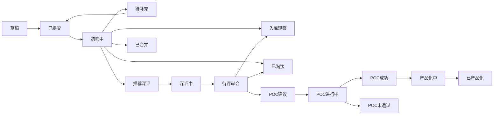
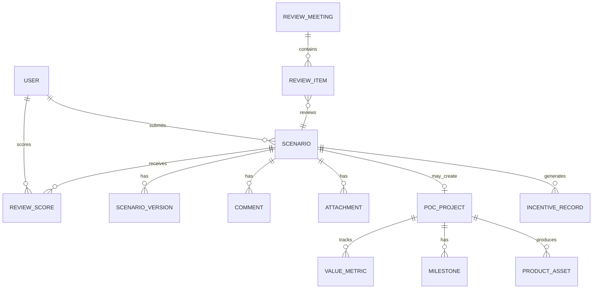
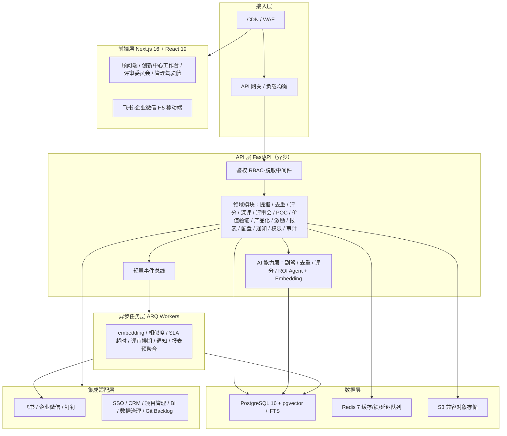

# SAP数智工程师场景提报与评审系统设计

> 文档定位：面向“金种子”场景众包计划的系统设计说明书  
> 适用对象：数智工程师创新中心、产品经理、FDE、SAP顾问、评审委员会、AI研发团队、IT实施团队  
> 核心目标：建设一个可支撑上千名SAP顾问持续提报、评审、立项、POC、产品化沉淀和激励兑现的场景管理系统，让“发现下一个APS”从偶然经验变成可运营、可度量、可复用的组织能力。

## 1. 建设背景

APS计划排程数智工程师已经证明：当一个场景具备经验依赖、高频重复、约束复杂、痛点明确、数据可得、结果可量化等特征时，AI可以承接其中的预测、优化、生成和异常识别能力，形成人机协同闭环，并在真实客户现场验证业务KPI与ROI。

下一阶段的关键问题不是“能不能做一个AI场景”，而是：

1. 如何让上千名SAP顾问低门槛、高质量地持续提报场景。
2. 如何用统一评分模型快速识别P0/P1高潜力场景。
3. 如何把评审、POC、产品化、案例沉淀、激励兑现形成闭环。
4. 如何把分散在客户现场的隐性经验，转化为可搜索、可复用、可销售的数智工程师资产。

因此需要建设一个“场景提报与评审系统”，作为金种子计划的数字化底座。

## 2. 系统目标

### 2.1 业务目标

| 目标 | 说明 |
|---|---|
| 提报规模化 | 支撑上千名顾问随时提交AI场景，降低提报门槛 |
| 评审标准化 | 用统一字段、统一评分、统一状态流转进行初筛和深评 |
| 价值可量化 | 立项即锁定baseline、ROI口径、业务KPI和数据来源 |
| 资产可复用 | 将成功场景沉淀为场景包、案例、评估集、组件需求和产品Backlog |
| 激励可兑现 | 将有效提报、初筛通过、POC立项、产品化成功与积分、奖金、荣誉挂钩 |
| 管理可视化 | 管理层可查看场景池、行业分布、漏斗转化、ROI、产品化进展 |

### 2.2 系统边界

本系统负责：

- 场景提报。
- 场景去重与合并。
- 四维初筛评分。
- 深度评估与评审会管理。
- POC立项建议与阶段跟踪。
- 价值验证结果归档。
- 产品化沉淀管理。
- 激励积分与贡献档案。
- 场景库检索、看板与报表。

本系统不直接负责：

- AI模型训练和推理服务。
- 生产系统数据同步的底层ETL。
- 客户项目合同、报价和收款。
- POC环境部署和客户侧权限审批。

但系统需要与这些系统或流程建立接口和交接物。

## 3. 用户角色与权限

| 角色 | 典型用户 | 核心权限 |
|---|---|---|
| 场景提报人 | SAP顾问、行业顾问、售前顾问 | 新建提报、编辑草稿、查看本人提报、补充材料、查看反馈 |
| 场景Owner | 通过初筛后指定的顾问/FDE | 维护深评材料、推动数据尽调、跟进POC、提交验证结果 |
| 创新中心初筛人 | 产品经理、FDE、SAP专家 | 查看全量提报、去重合并、初筛评分、退回补充、推荐深评 |
| 评审委员会成员 | 跨模块专家、管理层、AI研发负责人 | 查看待评审场景、评分、投票、提出意见、给出立项建议 |
| AI研发代表 | AI产品/算法/平台/后端研发 | 技术可行性评估、接口与数据需求评审、产品化Backlog维护 |
| 管理层 | 业务负责人、创新中心负责人 | 查看看板、审批P0资源、查看投入产出和产品化进展 |
| 系统管理员 | IT/运营管理员 | 用户、角色、字典、评分权重、流程配置、通知模板管理 |

### 3.1 权限原则

1. 提报人可见本人提报及公开场景库，不可见其他客户敏感细节。
2. 初筛人与评审人可见所属权限范围内的完整场景信息。
3. 涉及客户名称、数据样本、合同金额、供应商信息等字段需按权限脱敏。
4. 场景进入POC后，客户侧资料、样本数据、合同信息应启用更高权限等级。
5. 所有评分、状态变更、审批意见必须留痕。

## 4. 核心业务对象

| 对象 | 说明 |
|---|---|
| 场景 | 顾问提报的AI数智工程师候选场景，是系统主对象 |
| 场景版本 | 场景在补充、合并、深评、POC后的版本记录 |
| 评分卡 | 四维评分、100分细评、评审投票和评分理由 |
| 评审会 | 双周/月度评审会议，包含议题、参会人、结论和行动项 |
| 数据尽调记录 | 数据源、字段、质量、权限、样本可得性、风险 |
| POC项目 | 被立项的场景验证项目，包含周期、里程碑、KPI、结果 |
| 价值验证记录 | baseline、目标值、实际值、ROI测算、统计周期和数据来源 |
| 产品化资产 | 场景包、对象模型、接口清单、Prompt、工具、评估集、SOP、案例 |
| 激励记录 | 积分、奖金、署名、荣誉、晋升贡献记录 |
| 评论与附件 | 补充材料、访谈纪要、截图、流程图、样例数据说明 |

## 5. 场景状态机

### 5.1 状态定义

| 状态 | 含义 | 责任方 |
|---|---|---|
| 草稿 | 提报人尚未提交 | 提报人 |
| 已提交 | 提报字段完整，等待初筛 | 提报人/创新中心 |
| 待补充 | 初筛认为信息不足，退回补充 | 提报人 |
| 初筛中 | 创新中心进行去重、评分和初判 | 创新中心 |
| 入库观察 | 评分不足P1，但有参考价值 | 创新中心 |
| 推荐深评 | 初筛通过，进入深度评估 | 创新中心 |
| 深评中 | 进行数据尽调、ROI测算、技术评估 | 场景Owner/评审委员会 |
| 待评审会 | 深评材料完成，等待会议评审 | 场景Owner |
| POC建议 | 评审通过，建议立项POC | 评审委员会 |
| POC进行中 | 已立项并进入客户共创验证 | 场景Owner/FDE |
| POC成功 | POC达到价值验证标准 | 场景Owner/创新中心 |
| POC未通过 | POC未达到价值或可行性标准 | 场景Owner/创新中心 |
| 产品化中 | 进入标准产品、场景包或组件沉淀 | 产品化团队 |
| 已产品化 | 已形成可复制产品或标准场景包 | 产品化团队 |
| 已淘汰 | 不具备继续推进条件 | 创新中心/评审委员会 |
| 已合并 | 与已有场景重复或相近，合并到主场景 | 创新中心 |

### 5.2 状态流转



## 6. 功能模块设计

### 6.1 场景提报模块

#### 6.1.1 功能说明

面向顾问提供低门槛提报入口，支持PC和移动端。第一版提报字段控制在10项以内，避免过重表单导致提报冷场。

#### 6.1.2 轻量提报字段

| 字段 | 类型 | 必填 | 说明 |
|---|---|---:|---|
| 场景名称 | 文本 | 是 | 一句话命名，如“需求预测数智工程师” |
| 所属行业 | 单选/多选 | 是 | 离散制造、流程制造、新能源、消费品等 |
| 所属模块 | 多选 | 是 | PP、MM、SD、FICO、QM、PM/EAM、EWM、MDG等 |
| 客户/项目 | 文本/选择 | 否 | 可脱敏填写 |
| 业务痛点 | 长文本 | 是 | 当前瓶颈与代价 |
| 现状如何靠人解决 | 长文本 | 是 | 明确经验依赖点 |
| 决策频率与数量 | 结构化 | 是 | 每日/每周/月度，处理量级 |
| 可量化业务KPI | 多选+文本 | 是 | OTD、库存周转、月结天数、停机时间等 |
| 数据基础 | 选择+文本 | 是 | 数据在SAP/外围系统/文档中是否可得 |
| 预估价值 | 选择+金额/文本 | 否 | 降本、增效、增收、控险量级 |
| 客户付费意愿 | 单选 | 否 | 强/中/弱/未知 |
| 附件 | 文件 | 否 | 流程图、截图、样例报表、访谈纪要 |

#### 6.1.3 自动辅助能力

系统可提供顾问副驾能力：

- 根据场景名称自动推荐所属模块、流程、AI能力类型。
- 根据痛点描述自动提示“是否补充频率、KPI、数据来源”。
- 自动检查是否缺少关键字段。
- 根据已有场景库进行相似场景提示，减少重复提报。
- 根据字段自动生成初版场景摘要。

### 6.2 场景去重与合并模块

#### 6.2.1 去重规则

系统在提报提交后自动进行相似度检查：

| 维度 | 说明 |
|---|---|
| 名称相似 | 场景名称、关键词、数智工程师名称相似 |
| 模块相同 | 所属SAP模块和业务流程相同 |
| 痛点相似 | 业务痛点、经验依赖点、KPI相似 |
| 客户/行业相似 | 同一客户、行业或相似业务类型 |
| AI能力相似 | 同为预测、优化、审核、生成、异常识别等 |

#### 6.2.2 合并策略

- 完全重复：标记“已合并”，保留贡献人署名和提报时间。
- 相似但行业不同：合并为同一产品族，保留行业变体。
- 相似但数据条件不同：保留为同一场景下的不同实施版本。
- 不确定：进入人工去重确认。

### 6.3 初筛评分模块

#### 6.3.1 四维评分模型

初筛采用1-5分制，综合得分 = Σ(各维度得分 × 权重)。

| 一级维度 | 权重 | 评分要点 |
|---|---:|---|
| 业务价值 | 40% | ROI规模、降本/增效/增收/控险幅度、痛点紧迫度、客户付费意愿 |
| 技术可行性 | 25% | 数据可得性与质量、决策可建模性、技术成熟度、人机闭环可控性 |
| 可复制性 | 20% | 跨客户/跨行业通用度、流程标准化程度、产品化潜力 |
| 战略契合 | 15% | 客户战略匹配、竞争壁垒、标杆与生态价值 |

#### 6.3.2 分级规则

| 等级 | 分数 | 系统动作 |
|---|---:|---|
| P0 | ≥4.0 | 推荐优先立项POC，进入深评 |
| P1 | 3.0-3.9 | 进入深度评估，补充数据后排期 |
| P2 | 2.0-2.9 | 入库观察，等待条件成熟或合并 |
| 淘汰 | <2.0 | 反馈原因，沉淀为经验 |

#### 6.3.3 否决项

任一否决项命中，系统应提示初筛人必须选择“退回补充、入库观察或淘汰”，不能直接进入POC建议。

- 无明确业务Owner。
- 三个月内无法获得数据样本。
- 只能做演示，无法进入真实流程。
- ROI无法定义。
- 安全、合规、隐私或客户数据风险不可控。
- 关键动作要求完全自动化且没有人工确认。

### 6.4 深度评估模块

深度评估用于把一个高潜力提报变成可立项POC的问题定义。

#### 6.4.1 深评内容

| 评估项 | 输出 |
|---|---|
| 业务流程评估 | 当前流程图、异常处理流程、岗位职责 |
| 数据尽调 | 数据源、字段、样本、质量、权限、获取周期 |
| AI能力评估 | 预测/优化/RAG/Agent/多模态等能力适配度 |
| 闭环可行性 | 输出建议、审批、工单、看板、系统写回、人工确认方式 |
| ROI测算 | baseline、目标、收益、成本、回收期 |
| 风险评估 | 合规、安全、隐私、组织采纳、技术不确定性 |
| 资源评估 | FDE、研发、客户专家、数据接口、POC环境投入 |

#### 6.4.2 深评材料清单

- 完整场景卡。
- 数据尽调表。
- ROI测算表。
- 业务流程图。
- 人机协同闭环图。
- 风险清单。
- POC计划。
- 产品化潜力判断。

### 6.5 评审会模块

#### 6.5.1 评审会节奏

- 周度初筛会：处理新提报、去重、P2入库、淘汰反馈。
- 双周深评会：评审P0/P1候选场景，决定是否进入POC建议。
- 月度路演会：展示POC进展、成功案例、产品化成果、榜单和激励。

#### 6.5.2 评审议题字段

| 字段 | 说明 |
|---|---|
| 议题编号 | 自动生成 |
| 关联场景 | 选择场景 |
| 会议类型 | 初筛会/深评会/月度路演 |
| 汇报人 | 场景Owner |
| 参会人 | 评审委员、研发代表、业务负责人 |
| 会前材料 | 场景卡、评分卡、ROI表、数据尽调、附件 |
| 评审结论 | POC建议/补充材料/入库观察/淘汰/合并 |
| 行动项 | 责任人、截止日期、交付物 |

#### 6.5.3 投票与结论

评审委员会可采用“评分 + 投票 + 管理确认”的方式：

- 每位评委给出四维评分和评语。
- 系统计算平均分、最高/最低分、分歧度。
- 对P0/P1场景进行投票：通过、补充后再议、暂缓、淘汰。
- 管理层对资源投入进行最终确认。

### 6.6 POC管理模块

#### 6.6.1 POC阶段

| 阶段 | 时间 | 系统记录 |
|---|---|---|
| 立项 | 第0周 | POC目标、团队、客户、范围、指标 |
| 现场诊断 | 第1-2周 | 流程、数据样本、baseline、MVP范围 |
| MVP原型 | 第3-4周 | 原型、评价集、专家评分、技术风险 |
| 流程闭环 | 第5-8周 | 工单/审批/看板/写回/人工确认、日志与权限 |
| 业务验证 | 第9-12周 | KPI对比、ROI、复盘、产品化建议 |

#### 6.6.2 POC看板

看板字段：

- 当前阶段。
- 计划开始/结束日期。
- 里程碑完成率。
- 风险等级。
- 本周进展。
- 下周计划。
- 阻塞事项。
- 需要管理层协调事项。

### 6.7 价值验证模块

#### 6.7.1 指标配置

每个POC至少配置：

- 1个经济类指标。
- 1-3个业务KPI。
- baseline。
- 目标值。
- 实际值。
- 统计周期。
- 数据来源。
- 计算口径。
- 责任人。

#### 6.7.2 指标类别

| 类别 | 示例 |
|---|---|
| 效率类 | 任务自动化率、处理时效缩短、人均产能提升 |
| 质量类 | 决策准确率、错误率下降、返工率下降、合规率 |
| 经济类 | 年化人力成本节省、单位任务成本、投资回收期、ROI倍数 |
| 业务KPI类 | OTD、OEE、库存周转、月结天数、停机时间、DSO |

#### 6.7.3 ROI计算

建议系统支持基础ROI测算：

```text
年化收益 = 人力节省收益 + 业务改善收益 + 风险减少收益 + 增收收益
总投入 = POC投入 + 产品化投入 + 部署运维成本
ROI倍数 = 年化收益 / 总投入
投资回收期（月） = 总投入 / 月均收益
```

### 6.8 产品化沉淀模块

POC成功后，系统应将场景转入产品化沉淀流程。

#### 6.8.1 场景包资产

| 资产 | 说明 |
|---|---|
| 场景说明书 | 业务痛点、适用客户、价值、边界 |
| SAP对象映射 | 模块、对象、字段、接口、权限 |
| 外围系统接口清单 | MES、WMS、PLM、SCADA、SRM等 |
| 数据质量规则 | 必备字段、完整性、准确性、时效性 |
| Prompt和工具定义 | LLM提示词、Agent工具、函数调用 |
| 评价集模板 | 标准测试集、人工基线、验收样例 |
| ROI测算模板 | baseline、收益、成本、回收期 |
| 权限与审计模板 | 角色、日志、审批、回滚 |
| Demo脚本 | 演示数据、演示流程、讲解话术 |
| 交付SOP | 实施步骤、角色分工、风险检查 |

#### 6.8.2 产品化Backlog

系统应支持将POC中发现的共性需求转为产品Backlog：

- 数据连接器需求。
- 通用对象模型需求。
- 标准界面需求。
- 评估工具需求。
- 权限与审计能力需求。
- 部署运维需求。
- 行业模板需求。

### 6.9 激励与贡献档案模块

#### 6.9.1 积分规则

| 事件 | 积分建议 | 说明 |
|---|---:|---|
| 有效提报 | +10 | 通过完整性校验且非明显灌水 |
| 通过初筛 | +30 | 达到P1及以上 |
| 进入POC建议 | +80 | 评审委员会建议立项 |
| POC立项 | +120 | 客户共创项目启动 |
| POC成功 | +300 | 达到价值验证标准 |
| 产品化成功 | +500 | 形成可复制产品或场景包 |
| 提供复用案例 | +100 | 被其他客户或行业线复用 |

#### 6.9.2 贡献档案

每位顾问应有“金种子贡献档案”：

- 提报数量。
- 有效提报数。
- P0/P1场景数。
- POC立项数。
- POC成功数。
- 产品化数。
- 总积分。
- 署名案例。
- 荣誉记录。
- 晋升/绩效引用记录。

## 7. 数据模型设计

### 7.1 主要实体关系



### 7.2 场景表：scenario

| 字段 | 类型 | 说明 |
|---|---|---|
| id | string | 场景ID |
| title | string | 场景名称 |
| status | enum | 状态 |
| industry | array | 所属行业 |
| sap_modules | array | SAP模块 |
| process_domain | array | 端到端流程 |
| ai_capabilities | array | AI能力类型 |
| customer_name | string | 客户名称，可脱敏 |
| pain_point | text | 业务痛点 |
| human_process | text | 当前人工解决方式 |
| frequency | string | 决策频率 |
| volume | string | 处理数量 |
| kpi_candidates | array | 候选业务KPI |
| data_basis | text | 数据基础 |
| willingness_to_pay | enum | 付费意愿 |
| estimated_value | string | 预估价值 |
| submitter_id | string | 提报人 |
| owner_id | string | 场景Owner |
| duplicate_of | string | 合并到哪个主场景 |
| confidentiality_level | enum | 公开/内部/敏感/客户机密 |
| created_at | datetime | 创建时间 |
| updated_at | datetime | 更新时间 |

### 7.3 评分表：review_score

| 字段 | 类型 | 说明 |
|---|---|---|
| id | string | 评分ID |
| scenario_id | string | 场景ID |
| reviewer_id | string | 评分人 |
| score_type | enum | 初筛/深评/评审会 |
| business_value_score | number | 业务价值1-5 |
| feasibility_score | number | 技术可行性1-5 |
| replicability_score | number | 可复制性1-5 |
| strategic_fit_score | number | 战略契合1-5 |
| weighted_score | number | 加权分 |
| hundred_point_score | number | 100分细评分 |
| veto_flags | array | 否决项 |
| recommendation | enum | P0/P1/P2/淘汰/补充/合并 |
| comment | text | 评分理由 |
| created_at | datetime | 创建时间 |

### 7.4 POC项目表：poc_project

| 字段 | 类型 | 说明 |
|---|---|---|
| id | string | POC ID |
| scenario_id | string | 场景ID |
| customer | string | 共创客户 |
| owner_id | string | POC Owner |
| stage | enum | 立项/诊断/MVP/闭环/验证/完成 |
| start_date | date | 开始日期 |
| end_date | date | 计划结束日期 |
| baseline_locked | boolean | 是否已锁定baseline |
| risk_level | enum | 低/中/高 |
| result | enum | 成功/未通过/进行中 |
| roi_multiple | number | ROI倍数 |
| payback_months | number | 回收期 |

### 7.5 产品资产表：product_asset

| 字段 | 类型 | 说明 |
|---|---|---|
| id | string | 资产ID |
| scenario_id | string | 场景ID |
| poc_project_id | string | POC ID |
| asset_type | enum | 场景说明书/接口清单/评价集/Prompt/ROI模板/SOP/案例 |
| title | string | 资产名称 |
| owner_id | string | 负责人 |
| version | string | 版本 |
| file_url | string | 文件链接 |
| reusable_level | enum | 客户特有/行业可复用/通用组件 |
| status | enum | 草稿/审核中/可复用/废弃 |

## 8. 关键流程设计

### 8.1 提报到初筛流程

1. 顾问填写轻量提报表。
2. 系统进行完整性校验。
3. 系统进行相似场景提示。
4. 顾问确认提交。
5. 系统进入“已提交”状态并通知创新中心。
6. 创新中心进行去重、补充判断和四维评分。
7. 系统生成P0/P1/P2/淘汰建议。
8. 初筛人确认状态流转，并向提报人发送反馈。

### 8.2 深评到POC建议流程

1. P0/P1场景进入“推荐深评”。
2. 创新中心指定场景Owner。
3. 场景Owner补充深评材料。
4. AI研发代表进行技术可行性评估。
5. 数据负责人完成数据尽调。
6. 场景Owner提交评审会。
7. 评审委员会评分、投票、给出结论。
8. 通过后进入“POC建议”。

### 8.3 POC到产品化流程

1. POC立项后创建POC项目。
2. 系统锁定baseline和价值指标。
3. 每周维护POC进展、风险和阻塞。
4. 阶段结束提交验证结果。
5. POC成功后进入产品化中。
6. 产品化团队创建场景包资产。
7. 资产审核通过后进入已产品化。
8. 系统触发激励记录和案例沉淀。

## 9. 页面设计

### 9.1 顾问端页面

| 页面 | 功能 |
|---|---|
| 我的提报 | 草稿、已提交、待补充、已通过、已淘汰 |
| 新建提报 | 轻量提报表、相似场景提示、AI辅助补全 |
| 提报详情 | 场景状态、评分反馈、补充材料、评论 |
| 场景库 | 可检索公开场景、优秀案例、产品化场景 |
| 金种子贡献档案 | 积分、榜单、署名案例、激励记录 |

### 9.2 创新中心工作台

| 页面 | 功能 |
|---|---|
| 初筛队列 | 待初筛、待补充、相似场景、超时提醒 |
| 场景详情 | 完整字段、附件、历史版本、评论、操作日志 |
| 评分面板 | 四维评分、100分细评、否决项、推荐结论 |
| 去重合并 | 相似场景对比、合并、主场景选择 |
| 深评管理 | 数据尽调、ROI测算、技术评估、会议排期 |
| POC看板 | 阶段、进度、风险、里程碑、价值指标 |
| 产品化资产 | 场景包资产、组件需求、案例沉淀 |

### 9.3 评审委员会页面

| 页面 | 功能 |
|---|---|
| 待评审议题 | 会前材料、场景摘要、评分卡 |
| 评审打分 | 四维评分、投票、意见 |
| 会议纪要 | 结论、行动项、责任人、截止日期 |
| 历史评审 | 往期议题、结论、转化结果 |

### 9.4 管理驾驶舱

关键看板：

- 场景总数、有效提报数、P0/P1数量。
- 行业/模块/流程分布。
- 提报人和团队排行。
- 初筛通过率、深评通过率、POC成功率、产品化率。
- POC ROI总额、平均ROI、回收期分布。
- 产品化场景矩阵。
- 风险场景列表。
- 超期未处理事项。

## 10. 通知与SLA

| 事件 | 通知对象 | 渠道 | SLA |
|---|---|---|---|
| 场景提交成功 | 提报人 | 站内信/企业微信/邮件 | 即时 |
| 新场景待初筛 | 创新中心 | 站内信/待办 | 即时 |
| 初筛超时 | 创新中心负责人 | 站内信/企业微信 | 7个工作日 |
| 退回补充 | 提报人 | 站内信/企业微信 | 即时 |
| 推荐深评 | 场景Owner/研发代表 | 站内信/待办 | 即时 |
| 评审会排期 | 评审委员 | 日历/邮件 | 会前3天 |
| POC里程碑超期 | 场景Owner/创新中心 | 站内信/企业微信 | 即时 |
| POC成功 | 管理层/产品化团队/提报人 | 战报/站内信 | 即时 |
| 激励到账 | 提报人 | 站内信 | 即时 |

## 11. 权限与数据安全

### 11.1 数据分级

| 等级 | 示例 | 控制策略 |
|---|---|---|
| 公开 | 已产品化案例、脱敏场景说明 | 全员可见 |
| 内部 | 普通提报、评分、通用附件 | 内部授权可见 |
| 敏感 | 客户名称、价格、ROI、内部评审意见 | 角色权限可见 |
| 客户机密 | 样本数据、合同、供应商报价、生产数据 | 项目成员最小权限 |

### 11.2 安全要求

- 支持字段级脱敏。
- 支持附件权限控制。
- 支持操作日志和审计导出。
- 支持客户名称匿名化。
- 支持数据样本不入库，只记录链接和审批状态。
- 支持删除/归档敏感附件。

## 12. 报表与指标

### 12.1 运营指标

| 指标 | 说明 |
|---|---|
| 提报总数 | 全量场景数量 |
| 有效提报率 | 有效提报/总提报 |
| 初筛通过率 | P0/P1/总提报 |
| 深评通过率 | POC建议/深评场景 |
| POC成功率 | POC成功/POC立项 |
| 产品化率 | 已产品化/POC成功 |
| 平均初筛周期 | 提交到初筛结论的平均时间 |
| 平均深评周期 | 推荐深评到评审结论的平均时间 |

### 12.2 价值指标

| 指标 | 说明 |
|---|---|
| 年化收益汇总 | 所有成功POC估算年化收益 |
| 平均ROI倍数 | 成功POC ROI平均值 |
| 平均回收期 | 成功POC投资回收期 |
| 产品化贡献收入 | 产品化场景带来的收入 |
| 复用次数 | 场景包跨客户复用次数 |

### 12.3 人才与激励指标

| 指标 | 说明 |
|---|---|
| 活跃提报人数 | 指定周期内有有效提报的人数 |
| 人均提报数 | 有效提报/活跃提报人数 |
| 金种子顾问排行 | 按积分、POC成功、产品化贡献排序 |
| 团队贡献排行 | 按行业线、区域、部门统计贡献 |

## 13. 系统集成

| 集成对象 | 集成内容 |
|---|---|
| 企业微信/钉钉/飞书 | 通知、待办、审批、战报 |
| SSO/组织架构 | 用户、部门、角色、权限 |
| 文档库/知识库 | 场景包、案例、评估手册、SOP归档 |
| 项目管理系统 | POC项目、里程碑、任务、风险 |
| CRM | 客户、商机、行业、销售阶段 |
| Git/研发Backlog | 产品化需求、组件需求、版本状态 |
| BI系统 | 管理驾驶舱与统计报表 |
| 数据治理平台 | 数据尽调、字段目录、数据质量结果 |

## 14. 非功能要求

| 类别 | 要求 |
|---|---|
| 可用性 | 工作日核心时段可用性≥99.5% |
| 性能 | 常规列表查询≤2秒，详情页≤3秒 |
| 扩展性 | 支持至少5000名用户、10万条场景记录 |
| 审计 | 所有评分、状态变更、权限访问均需留痕 |
| 可配置 | 评分权重、状态流、字段字典、通知模板可配置 |
| 易用性 | 顾问首次提报控制在10分钟内完成 |
| 移动端 | 支持移动端查看、补充、审批和评论 |
| 安全 | 支持RBAC、字段脱敏、附件权限、日志审计 |

## 15. 技术选型

### 15.1 选型总原则

1. **对齐既有成熟栈**：与团队现有 APS 系列产品（Next.js + FastAPI + PostgreSQL + Anthropic Claude）保持一致，最大化复用人员技能、组件库、运维经验与 CI/CD 资产，降低交付与维护成本。
2. **SaaS 多租户优先**：面向上千名顾问的集中式 SaaS，统一一套实例服务多租户，按 `tenant_id` 行级隔离。
3. **AI 仅辅助、决策留痕**：所有 AI 能力（副驾、去重、评分辅助、ROI 测算）只产出建议，最终评分、状态流转、审批均需人工确认并留痕（呼应 6.3.3 否决项与 11 安全要求）。
4. **避免一期过度工程**：按 22 章 MVP 分期逐步引入向量检索、异步队列、BI 与外部集成，一期用最小技术集快速跑通闭环。
5. **可配置而非硬编码**：评分权重、状态流转、字段字典、通知模板、积分规则均配置化（呼应 14、23 章）。

### 15.2 分层技术选型

| 层 | 选型 | 版本 | 选型理由 | 备选 |
|---|---|---|---|---|
| 前端框架 | Next.js（App Router）+ React + TypeScript | Next.js 16 / React 19 / TS 5 | 与现有 APS 前端完全一致，SSR/路由/构建一体 | Vite SPA（一期原型可用） |
| UI 与样式 | Tailwind CSS + shadcn/ui + Arco Design | Tailwind 4 | shadcn 做轻量定制，Arco 提供企业级表单/表格/审批控件 | Ant Design |
| 大列表/表格 | AG Grid | 35 | 初筛队列、场景库、POC 看板等大数据量网格 | TanStack Table |
| 图表 | ECharts | 6 | 管理驾驶舱漏斗、分布、ROI 等可视化 | Recharts |
| 前端状态/数据 | Zustand + TanStack Query | — | 本地状态 + 服务端数据缓存，沿用现有约定 | Redux Toolkit |
| 移动端 | 响应式 Web + 飞书/企业微信 H5 容器 | — | 满足 14 章移动端查看/补充/审批/评论，免独立 App | 原生小程序 |
| 后端框架 | Python + FastAPI（异步） | Python 3.12 / FastAPI ≥0.115 | 与现有 APS 后端一致，原生 async、Pydantic 校验、OpenAPI | — |
| ORM/迁移 | SQLAlchemy 2.0（async）+ asyncpg + Alembic | SA 2.0 | 异步 ORM + 版本化迁移，沿用现有约定 | Tortoise ORM |
| 数据校验 | Pydantic v2 + pydantic-settings | v2 | 请求/响应/配置统一模型 | — |
| 主数据库 | PostgreSQL | 16 | 关系建模、JSONB、RLS、生态成熟；5000 用户 / 10 万场景单库足够 | — |
| 向量检索 | pgvector 扩展 | ≥0.7 | 场景去重/相似提示/语义检索，复用 PG 不引入独立向量库 | 独立向量库（Milvus/Qdrant） |
| 中文全文检索 | PostgreSQL FTS + pg_jieba/zhparser | — | 场景库关键词检索的中文分词 | Elasticsearch（规模升级后） |
| 缓存/锁/定时 | Redis | 7 | 缓存、分布式锁、SLA 延迟队列 | — |
| 异步任务 | ARQ（基于 Redis 的 async 队列） | — | 与 FastAPI 异步同栈：embedding、相似度、通知、SLA、报表预聚合 | Celery；Kafka 事件总线（规模升级） |
| 对象存储 | S3 兼容云 OSS | — | 附件存储，预签名 URL + 权限网关；样本数据不入库只存链接（落实 11.2） | — |
| LLM | Anthropic Claude，薄 `AsyncAnthropic` 封装 | claude-sonnet-4-6（默认）/ claude-haiku-4-5（轻量辅助） | 与现有 APS 唯一 LLM 一致，原生 tool-use；自研 orchestrator/registry 多 Agent | — |
| Embedding | 可插拔 `EmbeddingProvider`（默认中文 embedding，本地 BGE-m3 或云厂商 API） | — | Anthropic 无 embedding API，抽象成接口便于私有化/替换；向量落 pgvector | — |
| 鉴权 | OAuth2/OIDC SSO + JWT + RBAC | — | 对接飞书/企业微信/钉钉/企业 SSO，统一身份；字段级脱敏中间件 | — |
| 可观测性 | 结构化日志 + 审计表 + OpenTelemetry + Prometheus/Grafana | — | 满足 14 章审计与可用性监控 | — |
| 运行时/部署 | Docker + Kubernetes + CI/CD | — | 云 SaaS 多副本、滚动/蓝绿发布 | — |
| 包管理 | 后端 uv，前端 npm | — | 沿用团队约定 | — |

## 16. 总体技术架构

采用**模块化单体（Modular Monolith）**：单一 FastAPI 应用内部按领域划分模块，模块间通过清晰的服务接口与轻量事件总线解耦。理由：目标规模（5000 用户 / 10 万场景）单体完全够用，微服务会带来分布式事务、运维与调试成本；模块边界清晰后，未来如某模块（如 POC 看板、报表）成为热点可独立拆分。



领域模块与 6 章功能模块一一对应；AI 能力层、异步任务层、集成适配层为支撑横切层。

## 17. 多租户与权限架构

### 17.1 租户隔离

- **共享库 + 行级隔离**：所有业务表均带 `tenant_id`、`created_at`、`updated_at`，UUID 主键（沿用团队约定）。请求经鉴权后注入租户上下文，ORM 层统一追加 `tenant_id` 过滤，杜绝越租户访问。
- **行级安全（RLS）**：客户机密相关表（样本、合同、供应商）叠加 PostgreSQL Row Level Security 作为兜底防线。

### 17.2 RBAC 与数据分级

- **角色**：映射 3 章 7 类角色（提报人、场景 Owner、初筛人、评审委员、AI 研发代表、管理层、系统管理员），权限到「资源 + 动作」粒度，可在后台（23 章）配置。
- **数据分级**：落实 11.1 四级——公开 / 内部 / 敏感 / 客户机密——按字段与附件分别打标。
- **字段级脱敏**：序列化层统一脱敏中间件，对客户名称、价格、ROI、合同、样本等敏感字段按角色与场景状态动态脱敏（场景进入 POC 后提升敏感级别，呼应 3.1）。
- **附件权限网关**：附件经预签名 URL 访问，下载前校验角色与数据级别；样本数据不入库，仅记录链接与审批状态。
- **全量审计**：所有评分、状态变更、审批、权限访问写入 `audit_log`，支持导出（落实 11.2、14 审计）。

## 18. AI 能力架构

复用现有 APS 的 `orchestrator + registry` 多 Agent 模式：编排器按场景分发到领域 Agent，每个 Agent 经薄 `AsyncAnthropic` 封装调用 Claude，prompt 模板可在后台配置。

| AI 能力 | 对应功能 | 实现要点 | 人工兜底 |
|---|---|---|---|
| 顾问副驾 | 6.1.3 | 据场景名/痛点推荐模块·流程·AI 能力，字段补全提示、缺失项检查、生成初版摘要 | 顾问可改可弃 |
| 场景去重 | 6.2 | **双层召回**：结构化规则（模块/行业/关键词，6.2.1）+ pgvector 语义相似（cosine）→ 候选列表 | 人工确认/合并（6.2.2） |
| 评分辅助 | 6.3 | Claude 据场景卡产出四维评分建议 + 理由初稿 | human-in-the-loop 人工定分，不绕过否决项 6.3.3 |
| ROI 辅助测算 | 6.7.3 | 据 baseline/收益/成本给出 ROI 倍数与回收期草算 | 评审与管理层确认 |

**Embedding 流水线**：场景提交/更新 → 事件触发 ARQ 任务 → `EmbeddingProvider` 生成向量 → 落 pgvector → 去重与场景库语义检索查询。`EmbeddingProvider` 抽象为接口，默认中文友好模型（本地 BGE-m3 或云厂商 embedding），便于私有化替换。

**原则**：AI 输出全部标注「AI 建议」并可追溯模型与时间，决策动作一律人工确认且留痕。

## 19. 数据与状态机架构

### 19.1 数据模型补充

在 7 章已有表（`scenario` / `review_score` / `poc_project` / `product_asset`）基础上，补充支撑表（均含 `tenant_id`/`created_at`/`updated_at`、UUID 主键）：

| 表 | 用途 |
|---|---|
| `tenant` | 租户 |
| `user` / `role` / `permission` / `user_role` | 身份与 RBAC |
| `audit_log` | 全量操作留痕 |
| `scenario_version` | 场景版本（4 章） |
| `review_meeting` / `review_item` | 评审会与议题（6.5） |
| `data_diligence` | 数据尽调记录（6.4） |
| `value_metric` / `milestone` | 价值指标与里程碑（6.6/6.7） |
| `similarity_candidate` | 去重候选对 |
| `embedding`（pgvector 列） | 场景向量 |
| `comment` / `attachment` | 评论与附件 |
| `notification` / `sla_timer` | 通知与 SLA 计时 |
| `point_record` / `contribution_profile` | 积分与金种子贡献档案（6.9） |
| `dict_industry` / `dict_module` / `dict_process` / `dict_ai_capability` / `dict_kpi` | 配置字典（23 章） |
| `score_weight_config` / `state_machine_config` / `veto_rule` / `notice_template` | 评分权重/状态流/否决项/通知模板配置 |

### 19.2 可配置状态机引擎

5 章 16 个状态、复杂流转由**数据库驱动的状态机引擎**实现：`state_machine_config` 定义状态、允许的迁移、迁移所需角色与触发动作。状态变更经引擎校验后写库，并向轻量事件总线发布事件，由订阅者触发通知、积分、SLA 计时。修改流程无需改代码，满足 14 章「状态流可配置」。

## 20. 异步、SLA 与通知架构

ARQ Worker + Redis 延迟队列驱动所有异步与定时任务（落实 10 章）：

- **SLA 计时**：初筛超时（7 工作日）、POC 里程碑超期、退回补充等到点触发提醒。
- **评审会排期**：会前 3 天自动通知评委（日历/邮件）。
- **激励到账**：状态机事件触发积分写入与「激励到账」通知。
- **AI 异步**：embedding 生成、相似度计算、报表预聚合后台执行，不阻塞请求。
- **多渠道通知适配器**：站内信 / 飞书 / 企业微信 / 邮件统一抽象，按通知模板（可配置）与用户偏好分发。

## 21. 部署架构与非功能落地

### 21.1 云 SaaS 部署

Kubernetes 多副本部署 API 与 Worker（HPA 自动扩缩），托管 PostgreSQL（启用 pgvector）+ 托管 Redis + 对象存储 + CDN/WAF + SSO；多环境 dev/staging/prod，滚动或蓝绿发布，CI/CD 自动化构建与迁移。健康检查 + 多副本保障核心时段可用性 ≥ 99.5%。

### 21.2 非功能要求映射

| 14 章要求 | 技术落地手段 |
|---|---|
| 可用性 ≥99.5% | K8s 多副本 + 健康检查 + 滚动发布 + 托管中间件高可用 |
| 性能（列表≤2s、详情≤3s） | 合理索引 + 分页/游标 + Redis 缓存 + pgvector ANN 近似检索 |
| 扩展性（5000 用户 / 10 万场景） | PG 单库足量，预留读写分离与分区；ARQ 横向扩 Worker |
| 审计 | 统一 `audit_log` + 操作中间件，支持导出 |
| 可配置 | 字典/权重/状态流/否决项/通知模板/积分规则全部表驱动（23 章） |
| 易用性（首报≤10 分钟） | 轻量 10 项内表单 + 副驾补全 + 相似提示 |
| 移动端 | 响应式 Web + 飞书/企业微信 H5 容器 |
| 安全 | RBAC + RLS + 字段脱敏 + 附件鉴权 + 审计日志 |

### 21.3 分期技术演进

- **一期（提报+初筛闭环）**：Next.js + FastAPI + PostgreSQL + 基础通知；相似度先用「结构化规则 + FTS」，暂不上 pgvector/ARQ，最快跑通闭环。
- **二期（深评+评审会+POC）**：引入 pgvector 语义去重、ARQ 异步与 SLA、POC 看板与价值指标。
- **三期（产品化+激励+驾驶舱）**：引入 BI 集成、外部系统适配层、管理驾驶舱与复用统计。

> 与 22 章 MVP 业务分期一一对应，技术按需引入，避免一次性过度工程。

## 22. MVP版本规划

### 22.1 MVP一期：提报与初筛闭环

目标：快速启动金种子计划。

范围：

- 用户与角色。
- 轻量提报表。
- 我的提报。
- 初筛队列。
- 四维评分。
- 状态流转。
- 评论与附件。
- 基础通知。
- 场景库列表。

验收标准：

- 顾问可提交场景。
- 创新中心可在系统内完成初筛。
- 系统可生成P0/P1/P2/淘汰结论。
- 提报人可收到反馈。

### 22.2 二期：深评、评审会与POC管理

范围：

- 深度场景卡。
- 数据尽调表。
- ROI测算表。
- 评审会议题。
- 评委评分与投票。
- POC项目看板。
- 价值指标跟踪。

### 22.3 三期：产品化、激励与管理驾驶舱

范围：

- 产品化资产库。
- 场景包管理。
- 产品Backlog。
- 积分与激励记录。
- 金种子贡献档案。
- 管理驾驶舱。
- 复用统计。

## 23. 后台配置

管理员需要配置：

- 行业字典。
- SAP模块字典。
- 端到端流程字典。
- AI能力类型字典。
- KPI字典。
- 状态流转规则。
- 评分权重。
- 否决项。
- 通知模板。
- 角色权限。
- 积分规则。
- 评审会周期。

## 24. 关键验收用例

| 用例 | 验收点 |
|---|---|
| 顾问提交场景 | 必填校验、草稿保存、提交成功、通知触发 |
| 相似场景提示 | 输入场景名称后提示相似场景 |
| 初筛评分 | 四维评分自动计算综合分和等级 |
| 否决项命中 | 命中否决项后不能直接POC建议 |
| 退回补充 | 提报人收到补充原因，可再次提交 |
| 深评材料提交 | 场景Owner可上传数据尽调、ROI测算、流程图 |
| 评审投票 | 多评委评分，系统计算平均分和结论 |
| POC看板 | 阶段、风险、里程碑、指标可维护 |
| POC成功 | 触发产品化流程和激励记录 |
| 权限控制 | 普通顾问不可查看敏感客户附件 |

## 25. 风险与应对

| 风险 | 系统设计应对 |
|---|---|
| 提报质量低 | 表单引导、AI辅助补全、质量门槛、退回补充 |
| 大量重复场景 | 相似度提示、人工合并、产品族管理 |
| 评审标准不一致 | 统一评分模型、评分理由必填、评委分歧度展示 |
| POC价值难证明 | 立项前强制baseline、指标口径、数据来源 |
| 顾问参与度低 | 积分、榜单、署名、荣誉、晋升绩效挂钩 |
| 客户数据风险 | 数据分级、字段脱敏、附件权限、审计日志 |
| 资源被低价值场景占满 | P0/P1分级、组合管理、资源看板 |

## 26. 近期落地建议

1. 第1周：确认MVP一期范围、角色、字段、状态机和评分规则。
2. 第2周：完成原型设计，组织创新中心、顾问代表、评审委员评审。
3. 第3-4周：开发提报、初筛、评分、通知、基础场景库。
4. 第5周：选2-3个行业线试运行，收集30个以上提报。
5. 第6周：组织第一次周度初筛会，验证评分和退回补充流程。
6. 第7-8周：上线深评材料与评审会功能。
7. 第9-12周：立项2-3个POC，启动POC看板与价值验证模块。

## 27. 结语

场景提报与评审系统不是一个普通表单系统，而是SAP数智工程师战略的运营底座。它要把顾问现场经验、统一评审标准、FDE项目验证、产品化沉淀和激励机制连成闭环。

只有这个闭环跑起来，“发现下一个APS”才不会依赖偶然灵感，而会成为组织持续生产高价值AI场景的能力。
